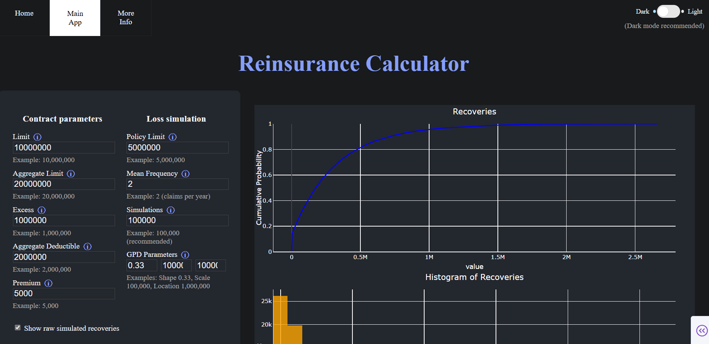
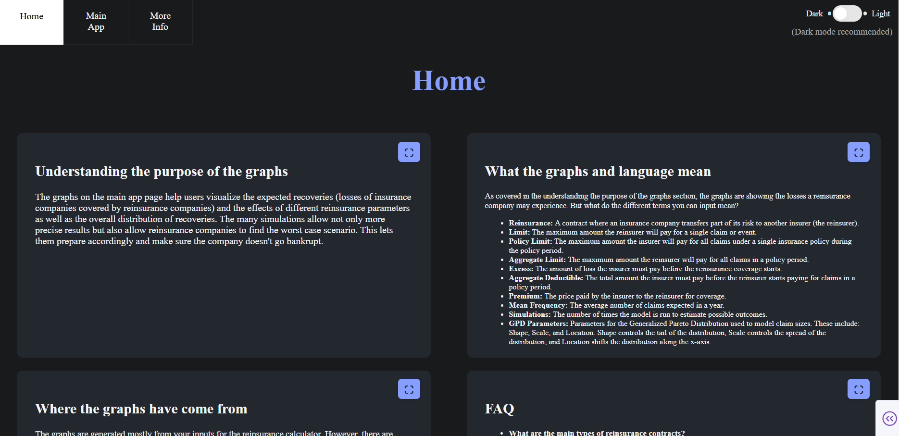
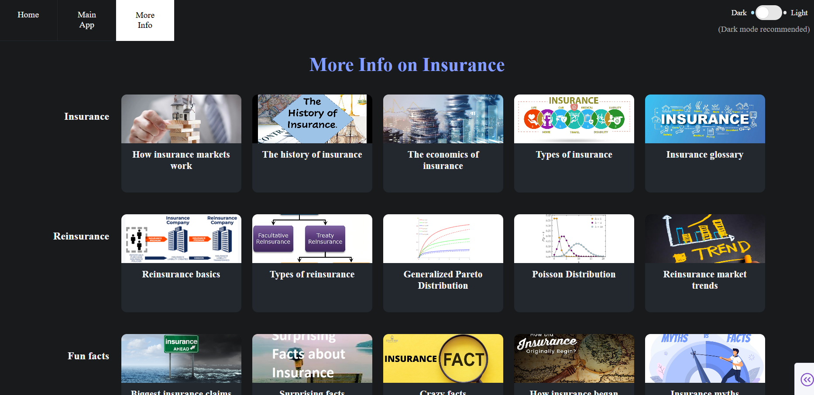

# Visualising Reinsurance: Building and Using My Interactive App

## Introduction
Reinsurance is a crucial part of the insurance industry. It allows insurance companies to manage risk of insolvency (not being able to pay policyholder's claims) by transferring portions of their liabilities (legal responsibilities of an individual or business for injuries or damages) to other insurers, known as reinsurers. In other words, reinsurance is insurance for insurance companies. This process helps to stabilise the insurance market by protecting companies from catastrophic losses and it ensures that policyholders are paid even in extreme scenarios.

Some key terms used in reinsurance contracts include:
- **Limit:** The maximum amount that an insurer or reinsurer will pay for a single claim or event under the terms of the policy or contract.
- **Policy Limit:** The maximum amount an insurer will pay for all claims under a single policy during the policy period.
- **Aggregate Limit:** The total maximum amount a reinsurer will pay for all claims combined during the policy period.
- **Excess:** The amount of loss the insurer must pay before reinsurance coverage begins.
- **Aggregate Deductible:** The total amount the insurer must pay before the reinsurer starts paying for claims in a policy period.
- **Premium:**  The price paid by the insurer to the reinsurer for coverage.

The purpose of my app is to make these concepts more accessible and understandable through interactive visualisations of recoveries (losses covered by reinsurance companies) which are simulated through your inputs and displayed on graphs, pie charts and histograms. By allowing users to input custom values for each parameter (the terms above and more) and see their impact on recoveries, my app aims to demystify reinsurance and help both students and professionals gain deeper insights into how reinsurance works.

## About Me
My name is Leo Kriz and I am a pupil of Sawston Village College. Currently, I am on work experience at Proteus Consulting in Chesterford Research Park. I have a passion for mathematics and problem solving and I am very interested in the world of insurance. As part of my work experience, I built a reinsurance app to deepen my understanding of this complex financial topic and to also learn about insurance through research (located on the more info page of my app). Through this project I have not only learnt a lot about the insurance industry, but I have also learnt how to make an app using python in dash on visual studio using the help of AI. My goal is to make financial concepts more accessible to others and I hope this app achieves this. In the future I hope to become an actuary or work in the insurance industry and I hope this is the first step.

## How I Designed My App
My main goal was to create an app that is both visually appealing and easy to use. I chose a card-based layout to separate different concepts, implemented both dark and light themes for accessibility and added a full screen feature for the cards on the home page. The app features interactive graphs and tooltips to help users understand each input.

Below is a screenshot of the main app page, alongside a code snippet showing how I set up the parameters that you can change in the app.

Screenshot of main app page (more graphs down the page):

You can see the blue information symbols next to the user inputs which explain what each one is.

```python
# Example code for simulating losses and setting up reinsurance parameters in the app
config.n_sims = n_sims

    sev_dist = distributions.GPD(shape=0.33, scale=100000, loc=1000000)
    freq_dist = distributions.Poisson(mean=mean_frequency)
    losses_pre_cap = FrequencySeverityModel(freq_dist, sev_dist).generate()
    losses_post_cap = np.minimum(losses_pre_cap, policy_limit)
    gross_losses = losses_post_cap

    agg_limit = [aggregate_limit] if aggregate_limit else [None]
    agg_deductible = [aggregate_deductible] if aggregate_deductible else [None]

    prog = XoLTower(
        limit=[limit],
        excess=[excess],
        aggregate_limit=agg_limit,
        aggregate_deductible=agg_deductible,  
        premium=[premium],
        reinstatement_cost=[[1, 1, 1], [1, 1, 1], [1, 1, 1], [1, 1, 1], [1, 1, 1]],
    )
```

Here is a screenshot of the home page, showing the card-based layout and full screen options:

Here is a screenshot of the more info page, which provides additional explanations and resources for users:

Code showing an example card:

```python
second_card = html.A(
        [
            html.Img(
                src="https://i.ytimg.com/vi/cxQzlwto64Y/maxresdefault.jpg",
                alt="The History of Insurance",
                style={
                    'width': '100%',
                    'height': '90px',
                    'objectFit': 'cover',
                    'display': 'block',
                    'borderTopLeftRadius': '10px',
                    'borderTopRightRadius': '10px'
                }
            ),
            html.Div(
                "The history of insurance",
                style=card_text("The history of insurance")
            )
        ],
        href="https://worldhistoryjournal.com/2025/03/09/the-history-of-insurance-industry/",
        target="_blank",
        style={**card_style, 'textDecoration': 'none'}
    )
```

I used Dash and Plotly for the frontend, which allowed me to quickly build interactive visualisations. I also used the Proteus Actuarial Library (PAL) to access an example model. 

## How the Calculations Work
After taking into account your inputs for the range of claim sizes, mean frequency of claims and number of simulations as well as the shape of the graph, the app uses a simulation-based approach to estimate reinsurance recoveries. For each simulation, it first generates a random number of claims using a Poisson distribution (to model claim frequency). Then, for each claim, it draws a random claim size from a Generalized Pareto Distribution (to model severity). By running thousands of these simulations, the app builds up a picture of possible outcomes, which are then visualized using interactive graphs and charts. The calculations are performed using Python libraries such as NumPy (for efficient numerical operations) and the results are displayed using Dash and Plotly. Below is an example for calculating the excess.

```python
# Example code for applying the excess (deductible) to simulated claim amounts
losses_pre_excess = FrequencySeverityModel(freq_dist, sev_dist).generate()
# Apply the excess: only the amount above 'excess' is covered
losses_after_excess = np.maximum(losses_pre_excess - excess, 0)
```

## Challenges and Solutions
One challenge that I had to overcome when constructing my app was designing an interface that was both visually appealing and easy to use. I experimented with different layouts and added features like card-based sections, tooltips, and theme switching to improve the user experience.

Another challenge was getting started with the project. I learnt from some tutorials about using python in dash as I had never done this before. However, this new way of coding seemed confusing. I then started using copilot AI which was very helpful both in terms of speed of coding and giving useful ideas.

An example of a third challenge I had to overcome is learning complicated reinsurance terms. I did some research on this which allowed me to understand the different key terms in reinsurance contracts which allowed me to gain a better understanding of the topic I was construting an app on.

Through solving these challenges, I learned a lot about both programming and the insurance industry, and I improved my problem-solving skills.

## User Guide
1. **Accessing the App:**  
   Open the app in your web browser at [Open the Reinsurance App](http://127.0.0.1:8050/)

2. **Full screen:**
   Click the symbol in the top right of the cards on the home page to fullscreen them. Click again to return.

3. **Changing pages:**
   Find the page toggle in the top left. Click on the page you want to be sent there.

4. **Setting Parameters:**  
   Use input boxes to set values for the various parameters. Simply click on the input box and you can change the example.

5. **Running Simulations:**  
   After selecting your chosen parameters, press the submit button and wait for the graphs to load.

6. **Interpreting Results:**  
   Hover over the graphs to see detailed values. Use the tooltips for explanations of each term.

7. **Switching Themes:**  
   Click the theme toggle button to switch between light and dark mode.

8. **Other Problems:**
   If the graphs don't load, refresh the page. Consider using a lower amount of simulations or mean frequency. If the submit button doesn't work, check your inputs to see if any yellow text is below it. Adjust your inputs according to what it says. If you want to change your parameters, just click on the input boxes again and press submit, the graphs will update.

**Tips for Best Results:**

- Try changing the **limit** and **excess** values to see how they affect the amount covered by reinsurance for each claim.
- Adjust the **mean frequency** to simulate more or fewer claims and observe how this impacts the total recoveries and the shape of the graphs.
- Experiment with different **aggregate deductible** and **aggregate limit** values to understand how these terms influence the total amount paid by the reinsurer over the policy period.
- Use both **light and dark themes** to see which is easier for you to read.
- Explore extreme scenarios, such as very high or very low claim sizes, to see how reinsurance protects insurers in rare but severe events.
- Hover over the graphs to get detailed information about each data point and use the tooltips for explanations of key terms.

## Conclusion
Building this app has deepened my understanding of both reinsurance and programming. I hope it helps others visualise and experiment with reinsurance concepts in an interactive way. Whether you are a student, professional, or just curious, I encourage you to try the app and learn about reinsurance as well as the wonderful world of insurance as a whole.

You can try the app here: [Open the Reinsurance App](http://127.0.0.1:8050/)